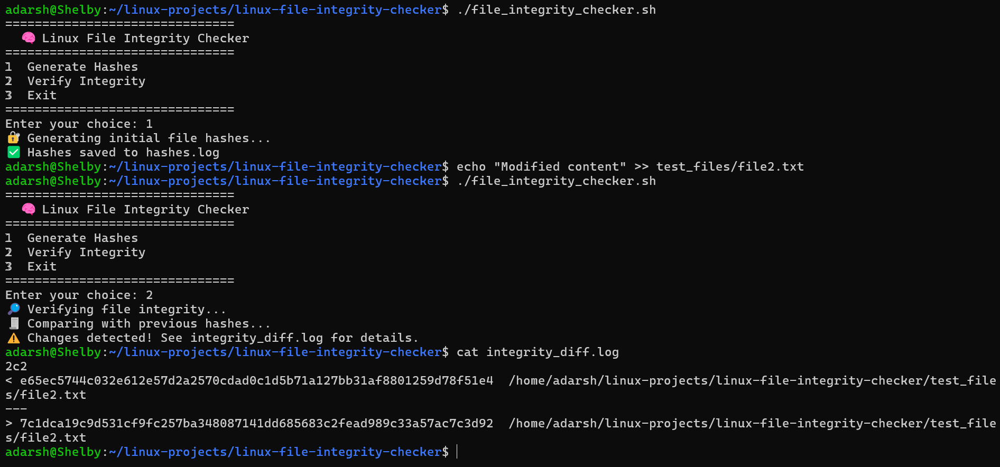

# 🔐 Linux File Integrity Checker

### 👨‍💻 Author

**Adarsh Shivan**<br>GitHub: [https://github.com/adarshshivan](https://github.com/adarshshivan)

---

## 📘 Overview
The Linux File Integrity Checker is a Bash-based security utility that helps detect unauthorized modifications or corruption in important files.
It works by generating and storing SHA256 hashes of files, then comparing them later to verify their integrity.
This lightweight script is ideal for system administrators, developers, and Linux learners who want to understand file monitoring and change detection in real time.

---

## 🧰 Features
- Generates and verifies file hashes using sha256sum
- Detects file tampering or unauthorized modifications
- Logs all integrity results and differences
- Easy-to-use menu interface (Generate / Verify / Exit)
- Works on all Linux distributions including WSL Ubuntu

---

## ⚙️ Tools & Technologies Used
- 🐧 Linux / WSL (Ubuntu)
- 💻 Bash Scripting
- 🔒 sha256sum, diff, find, awk commands
- 🧾 GitHub (for version control)
- ✍️ VS Code / Nano (for editing scripts)

---

## 🧩 How It Works

1. The script first scans a target directory and records the SHA256 hash of every file.
2. When verifying integrity, it rescans the directory and regenerates the hashes.
3. It compares old and new hashes to detect changes using the diff command.
4. Results are saved in integrity_diff.log for detailed analysis.
5. The tool outputs a clean summary showing whether files were changed or remain intact.

---

## ▶️ Usage Instructions

### 1️⃣ Make It Executable
```bash
chmod +x file_integrity_checker.sh
```
### 2️⃣ Run the Script
```bash
bash file_integrity_checker.sh
```

Or (if executable):

```bash
./file_integrity_checker.sh
```

---

### 📂 Example Output

▶️ After Running



---

### 🎓 What I Learned

- How to use sha256sum for file verification
- Implementing hash-based integrity checking in Bash
- Logging system activity using redirection operators
- Writing secure and automated Linux scripts
- Structuring real-world scripts for GitHub portfolios

---

### 🧠 Project Summary

The Linux File Integrity Checker is a practical Bash script designed to protect data integrity and detect file tampering.
By using SHA256 checksums, it provides a reliable and lightweight verification method suitable for both security demonstrations and real-world file monitoring.

This project demonstrates proficiency in:

File system security and hash verification

Linux automation scripting

Change detection and log analysis

